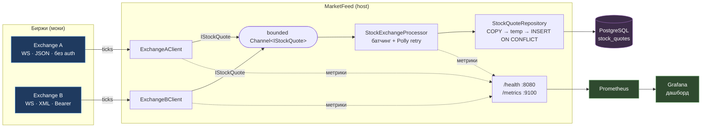

# MarketFeed — агрегатор биржевых котировок

Сервис в реальном времени собирает котировки с нескольких биржевых WebSocket-источников,
приводит их к единому формату, отсеивает дубликаты, пакетно сохраняет в PostgreSQL и
отдаёт метрики для мониторинга.

---

## Особенности реализации

В рамках тестового задания коммуникация ограничена, поэтому ряд решений принимал
самостоятельно. В реальном проекте такие изменения были бы
согласованы с заказчиком/поставщиком данных заранее.

- **Расширение модели данных.** К изначально описанной в ТЗ структуре
  `{ticker, price, volume, timestamp}` добавлены два поля:
  - `exchange` — биржа-источник: нужна, чтобы различать потоки от разных источников и
    входит в ключ дедупликации;
  - `quote_id` — идентификатор котировки/транзакции: служит идентичностью записи, по
    которой отсекаются дубликаты (`PRIMARY KEY (exchange, quote_id)`).

  служат для различия источника и дедупликации данных.
  Для биржи, которая `quote_id` не присылает, он детерминированно выводится из содержимого
  котировки (см. раздел про биржу B).

- **Идентичность котировки vs инстанса клиента.** В котировке `exchange` = **тип биржи**
  (константа, напр. `"ExchangeA"`) — поэтому дедуп работает между инстансами одной биржи.
  У клиента отдельно есть `InstanceName` (напр. `"ExchangeA-AAPL"`) — он используется только
  в логах и метриках, чтобы различать несколько инстансов одной биржи.

---

## Возможности

- **Несколько источников** одновременно, в т.ч. **несколько инстансов клиента на одну биржу** (например, отдельный поток только по `AAPL`) — список задаётся в конфиге.
- **Нормализация** разнородных форматов (JSON / XML) к единой модели `{exchange, quote_id, ticker, price, volume, timestamp}`.
- **Дедупликация** по ключу `(exchange, quote_id)` — на уровне БД (`INSERT … ON CONFLICT DO NOTHING`).
- **Пакетная запись** через `System.Threading.Channels` (producer/consumer) с флашем по размеру батча или по таймеру.
- **Устойчивость к обрывам**: авто-реконнект с экспоненциальным backoff, ретраи записи только на транзиентных ошибках, корректное завершение с дозаписью буфера.
- **Наблюдаемость**: Prometheus-метрики на выделенном порту (по умолчанию `9100`), liveness на `/health`, готовый дашборд Grafana.

---

## Архитектура



**Поток данных:**
1. Клиенты бирж (`ExchangeAClient`, `ExchangeBClient`) держат WebSocket-соединение, парсят входящие сообщения и нормализуют их в `IStockQuote`.
2. Нормализованные котировки пишутся в ограниченный `Channel<IStockQuote>` (backpressure при переполнении).
3. `StockExchangeProcessor` (фоновый `BackgroundService`) вычитывает канал, копит батч и сохраняет его, когда набралось `BatchSize` либо прошёл `SaveInterval`.
4. Репозиторий грузит батч бинарным `COPY` во временную таблицу и делает `INSERT … ON CONFLICT DO NOTHING` — так дубликаты отсекаются и возвращается число реально вставленных строк.
5. По ходу работы пишутся метрики; Prometheus их скрейпит, Grafana визуализирует.

---

## Структура решения

| Проект | Назначение |
|---|---|
| `MarketFeed.Host` | Web-host: DI (Autofac), `StockExchangeProcessor`, фабрика клиентов, `/health` и `/metrics`, NLog, реализация метрик (`PrometheusMetrics`). |
| `MarketFeed.Abstractions` | Контракты: `IStockQuote`, `IStockExchangeClient`, `IStockQuoteRepository`, `IClientMetrics` / `IProcessorMetrics`, исключения. |
| `MarketFeed.StockExchangeClients.Common` | `BaseStockExchangeClient` — общая WS-логика: коннект/реконнект, idle-timeout, приём, метрики. |
| `MarketFeed.StockExchangeClients.StockExchangeClientA` | Клиент биржи A: JSON, без аутентификации, `quote_id` приходит от биржи. |
| `MarketFeed.StockExchangeClients.StockExchangeClientB` | Клиент биржи B: XML, Bearer-токен, `quote_id` детерминированно выводится из содержимого. |
| `MarketFeed.DataAccess` (`MarketFeed.DataAccess.PostgreSQL`) | Репозиторий на Npgsql: бинарный COPY + temp-таблица + `ON CONFLICT`. |
| `MarketFeed.Database` | `init.sql` — схема БД (накатывается контейнером Postgres при первом старте). |
| `MarketFeed.MockStockExchanges.ExchangeA` | Мок-биржа A (JSON, без auth). |
| `MarketFeed.MockStockExchanges.ExchangeB` | Мок-биржа B (XML, Bearer). |
| `MarketFeed.UnitTests` | Юнит-тесты процессора (NUnit + FluentAssertions, без Docker). |
| `MarketFeed.DataAccess.Tests` | Интеграционные тесты репозитория (Testcontainers + PostgreSQL). |

---

## Особенности мок-бирж

| | Биржа A | Биржа B |
|---|---|---|
| Формат | JSON (`System.Text.Json`) | XML (`XmlSerializer`) |
| Аутентификация | нет | Bearer-токен в заголовке handshake |
| `quote_id` | присылает биржа (поле `id`) | нет — клиент выводит `SHA256(exchange\|ticker\|price\|volume\|timestamp)` |
| Подписка | `{ "tickers": [...] }` | `<subscribe><symbol>…</symbol></subscribe>` |
| Шумовые поля | `venue`/`seq`/`src` — игнорируются | — |

---

## Как добавить новую биржу

1. **Новый клиент биржи** — Клиент должен реализовывать интерфейс [`MarketFeed.Abstractions.IStockExchangeClient`](MarketFeed.Abstractions/IStockExchangeClient.cs). Рекомендуется унаследоваться от абстрактного класса [`MarketFeed.StockExchangeClients.Common.BaseStockExchangeClient`](MarketFeed.StockExchangeClients.Common/BaseStockExchangeClient.cs).

2. **Enum** — Добавить значение в enum [`ExchangeType`](MarketFeed.Host/Enums/ExchangeType.cs):
   ```csharp
   public enum ExchangeType : byte { Undefined = 0, ExchangeA = 1, ExchangeB = 2, /*NEW*/ ExchangeC = 3 }
   ```

3. **Фабрика** [`StockExchangeClientFactory`](MarketFeed.Host/StockExchangeClientFactory.cs) — ветка в `CreateClient` + добавить необходимые опциональные настройки в класс [`StockClientConfiguration`](MarketFeed.Host/Settings/StockClientConfiguration.cs) и маппинг опций в настройки нового клиента (e.g. `ToOptionsC`):
   ```csharp
   ExchangeType.ExchangeC => new ExchangeCClient(
       ToOptionsC(configuration), _loggerFactory.CreateLogger<ExchangeCClient>(), _metrics),
   ```

4. **Конфиг** — добавить запись в массив `Exchanges` ([appsettings.json](MarketFeed.Host/appsettings.json)) и, для Docker, оверрайд эндпоинта в [`docker-compose.yml`](docker-compose.yml):
   ```json
   { "ExchangeType": "ExchangeC", "InstanceName": "ExchangeC", "Endpoint": "ws://localhost:5099/ws", "Tickers": [] }
   ```

> Можно добавлять несколько инстансов одной биржи — просто несколько записей в `Exchanges` с разными `InstanceName` (например, отдельный поток только по `AAPL`).

---

## Устойчивость

- **Авто-реконнект**: при обрыве соединения клиент переподключается (Polly с экспоненциальным backoff с джиттером). Подписка переотправляется на каждом коннекте.
- **Перманентные ошибки**: 4xx на handshake (например, неверный токен — `401`) распознаются и не ретраятся бесконечно — клиент останавливается с `Critical`-логом.
- **Idle-timeout**: если данные не приходят дольше таймаута, соединение разрывается и переустанавливается.
- **Ретраи записи**: только транзиентные ошибки БД (`TransientStorageException`) ретраятся; перманентные — батч дропается (с метрикой и логом), обработка продолжается.
- **Graceful shutdown**: при остановке канал закрывается, остаток буфера дозаписывается.

---

## Наблюдаемость

**Метрики** (Prometheus, выделенный порт `9100`, путь `/metrics`):

| Метрика | Тип | Описание |
|---|---|---|
| `ticks_received_total{exchange}` | counter | принято и поставлено в очередь котировок |
| `ticks_persisted_total` | counter | реально вставлено в БД (после дедупа) |
| `reconnects_total{exchange}` | counter | переподключений после обрыва |
| `batches_saved_total` / `batches_dropped_total` | counter | успешные / дропнутые батчи |
| `parse_errors_total{exchange}` | counter | неразобранные сообщения |
| `channel_depth` | gauge | текущая глубина очереди (backpressure) |
| `connected_clients{exchange}` | gauge | состояние соединения (1/0) |
| `batch_save_duration_seconds` | histogram | время сохранения батча |
| `batch_size` | histogram | размер флашнутого батча |

Label `exchange` несёт **`InstanceName`** клиента — поэтому несколько инстансов одной биржи (напр. `ExchangeA` и `ExchangeA-AAPL`) видны в метриках раздельно.

**Дашборд Grafana** провижинится автоматически (датасорс + дашборд монтируются в контейнер) — после `docker compose up` он сразу доступен и является стартовой страницей, без логина и ручного импорта.

**Health**: `GET /health` — liveness-проба.

---

## Быстрый старт

Нужен только **Docker** (с Docker Compose).

```bash
docker compose up --build
```

Поднимется весь стенд: PostgreSQL, две мок-биржи, сервис, Prometheus и Grafana.

| Сервис | URL | Назначение |
|---|---|---|
| Grafana | http://localhost:3000 | дашборд (анонимный доступ) |
| Prometheus | http://localhost:9090 | `Status → Targets` покажет `marketfeed = UP` |
| MarketFeed | http://localhost:9100/metrics · http://localhost:8080/health | метрики (9100) и health (8080) |
| Exchange A (mock) | ws://localhost:5008/ws | источник A |
| Exchange B (mock) | ws://localhost:5073/ws | источник B |
| PostgreSQL | localhost:5432 (`postgres`/`postgres`, db `market_feed`) | хранилище |

---

## Конфигурация

```jsonc
"StockExchangeProcessor": {
  "ChannelMaxSize": 10000,     // ёмкость канала (backpressure)
  "BatchSize": 1000,           // сохранение по достижении размера
  "SaveInterval": "00:01:00",  // либо по таймеру
  "SaveRetry": {               // ретрай записи батча (Polly, только транзиентные ошибки БД)
    "MaxRetryAttempts": 3,
    "Delay": "00:00:00.200",
    "MaxDelay": "00:00:05"
  }
},
"Metrics": { "Port": 9100 },  // порт эндпоинта /metrics

// Список клиентов: каждая запись — отдельный инстанс. Можно несколько на одну биржу.
"Exchanges": [
  { "ExchangeType": "ExchangeA", "InstanceName": "ExchangeA",     "Endpoint": "ws://localhost:5008/ws", "Tickers": [] },
  { "ExchangeType": "ExchangeA", "InstanceName": "ExchangeA-AAPL", "Endpoint": "ws://localhost:5008/ws", "Tickers": ["AAPL"] },
  { "ExchangeType": "ExchangeB", "InstanceName": "ExchangeB",     "Endpoint": "ws://localhost:5073/ws", "AuthToken": "secret-token", "Tickers": [] }
]
```

- `ExchangeType` — дискриминатор (какой клиент создаётся)
- `InstanceName` — имя инстанса для логов/метрик
- `Tickers: []` — подписка на все тикеры.
- `ReconnectDelay`, `MaxReconnectDelay`, `MaxRetryAttempts`, `IdleTimeout` - параметры устойчивости клиента.
- `StockExchangeProcessor.SaveRetry` (`MaxRetryAttempts`/`Delay`/`MaxDelay`) - ретраи записи батча в БД.
- `ConnectionStrings:StockQuoteRepository` - Строка подключения к бд. 
…

**Параметры мок-бирж** (env в compose):
- `QuotesPerSecond` - количество запросов в секунду.
- `DuplicatePercent` - доля повторных сообщений для проверки дедупа
- `DropConnectionMinSeconds` / `DropConnectionMaxSeconds` - периодический обрыв для проверки реконнекта
- `AuthToken` - только для мок биржи B

---

## Схема БД

```sql
CREATE TABLE stock_quotes (
    exchange    TEXT        NOT NULL,
    quote_id    TEXT        NOT NULL,
    ticker      TEXT        NOT NULL,
    price       NUMERIC     NOT NULL,
    volume      BIGINT      NOT NULL,
    exchange_ts TIMESTAMPTZ NOT NULL,

    PRIMARY KEY (exchange, quote_id)
);
```

---

## Тесты

```bash
# Юнит-тесты процессора (Docker не нужен)
dotnet test MarketFeed.UnitTests

# Интеграционные тесты репозитория (нужен запущенный Docker — Testcontainers сам поднимет PostgreSQL)
dotnet test MarketFeed.DataAccess.Tests
```
---

## Возможности для улучшения

- **Партиционирование `stock_quotes` по `ExchangeName`.** Разбить таблицу по бирже — каждая в своей партиции: индексы меньше, вставки и выборки по конкретной бирже дешевле.
- **Алёрты на деградацию.** Счётчики ошибок (`batches_dropped_total`, `parse_errors_total`) и сигналы здоровья (`channel_depth`, `batch_save_duration_seconds`) уже собираются — на их основе настроить алёрты (Datadog/Prometheus Alertmanager) при накоплении ошибок или ухудшении метрик.
- **Эндпоинт выборки данных + индексы.** API для чтения котировок по тикеру/времени; под это — индексы на `ticker` и `exchange_ts` (сейчас только PK `(exchange, quote_id)`).
